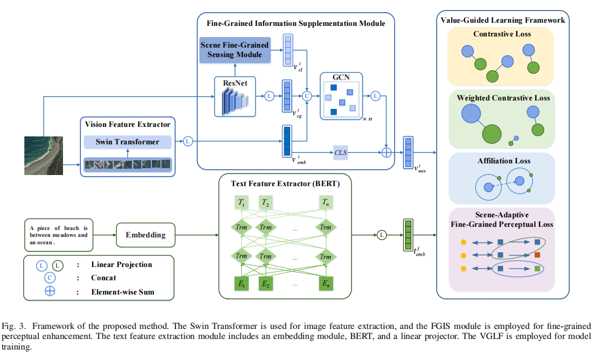

# Fine-Grained Information Supplementation and Value-Guided Learning for Remote Sensing Image-Text Retrieval
This repo provides the official implementation of our paper:
> [**Fine-Grained Information Supplementation and Value-Guided Learning for Remote Sensing Image-Text Retrieval**](https://ieeexplore.ieee.org/stamp/stamp.jsp?arnumber=10716520)

- [Fine-Grained Information Supplementation and Value-Guided Learning for Remote Sensing Image-Text Retrieval]
  - [ℹ️ Introduction](#ℹ️-introduction)
  - [🎯 Getting Start](#-getting-start)
    - [Project Files](#project-files)
    - [Environments](#environments)
    - [Train](#train)
    - [Test](#test)
  - [🌎 Datasets](#-datasets)
  - [🙏 Acknowledgement](#-acknowledgement)
  - [📝 Citation](#-citation)

## ℹ️ Introduction
We propose a fine-grained information supplementation and value-guided learning (FISVL) model. Feature enhancement is carried out by integrating the prior knowledge in the field of recommendation systems, and a value-oriented training strategy is adopted to learn feature representations that are fine-grained, highly expressive and robust. Specifically, FISVL contains the following core modules:
1. ​**fine-grained information supplementation (FGIS)​**: By fusing the visual information of global and local features, the perception ability of the model for multi-scale features of remote sensing images is enhanced, and the problem of representation limitations caused by insufficient feature granularity in traditional methods is solved.
2. ​**Double loss optimization mechanism**: Aiming at the problem of excessive similarity within the mode, weighted contrast loss (the weighting strategy refers to the dynamic adjustment method of sample importance) and scene adaptive fine-grained perceptial loss are proposed to improve the model discrimination ability by constraining the spatial distribution of features.
3. ​**Value-Guided Learning Framework**: enables the model to focus on the most valuable information at different training stages, thereby adapting to the specific requirements of each phase.
We verify the validity of the model on the RSICD and RSITMD datasets. The results show that this method reaches the leading level in both fine-grained feature learning and cross-modal alignment tasks.



## 🎯 Getting Start
### Project Files


### Environments

```bash
pip install -r requirements.txt
```

### Train

### Test

## 🌎 Datasets

Our experiments are based on [RSITMD](https://github.com/xiaoyuan1996/AMFMN/tree/master/RSITMD) and [RSICD](https://github.com/201528014227051/RSICD_optimal) datasets.

## 🙏 Acknowledgement

- Basic code to thank [X-VLM](https://github.com/zengyan-97/X-VLM) 

## 📝 Citation
```bibtex
@article{zhou2024fine,
  title={Fine-Grained Information Supplementation and Value-Guided Learning for Remote Sensing Image-Text Retrieval},
  author={Zhou, Zihui and Feng, Yong and Qiu, Agen and Duan, Guofan and Zhou, Mingliang},
  journal={IEEE Journal of Selected Topics in Applied Earth Observations and Remote Sensing},
  year={2024},
  publisher={IEEE}
}
```
